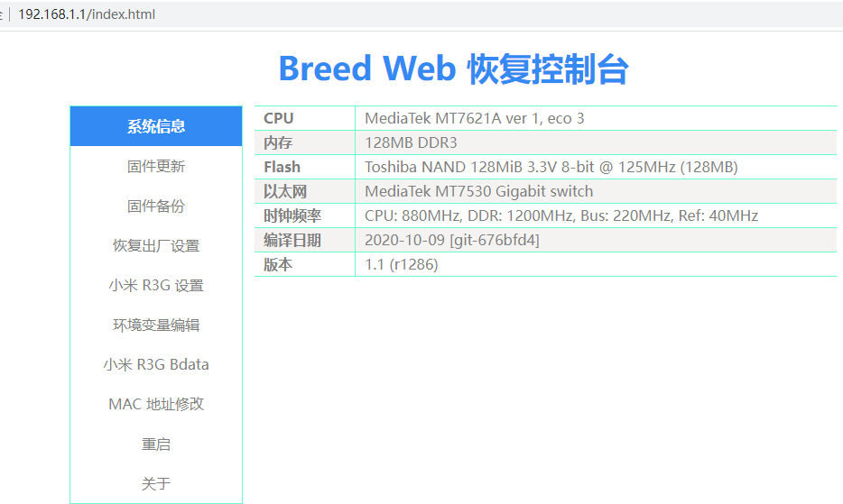
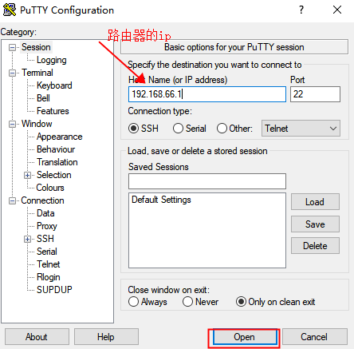
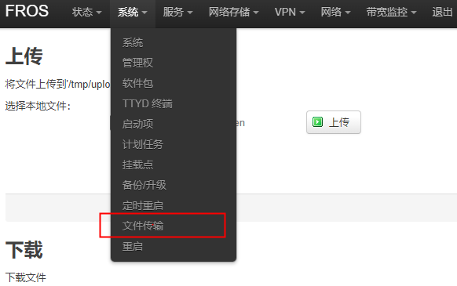
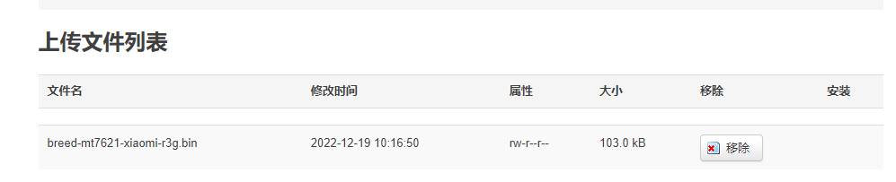
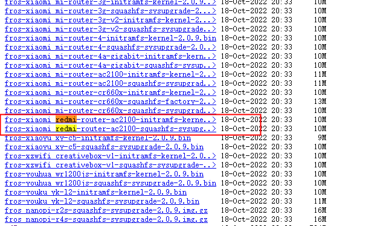
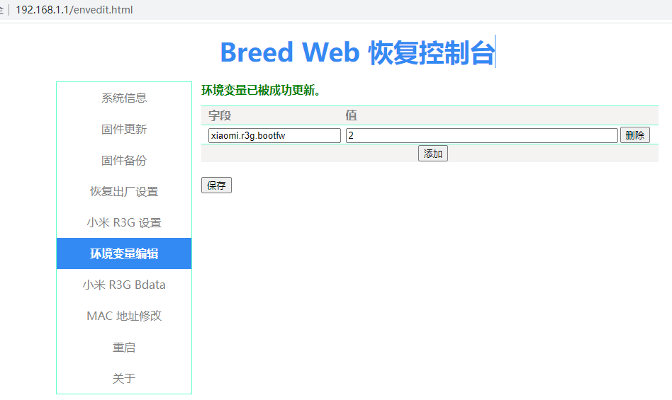
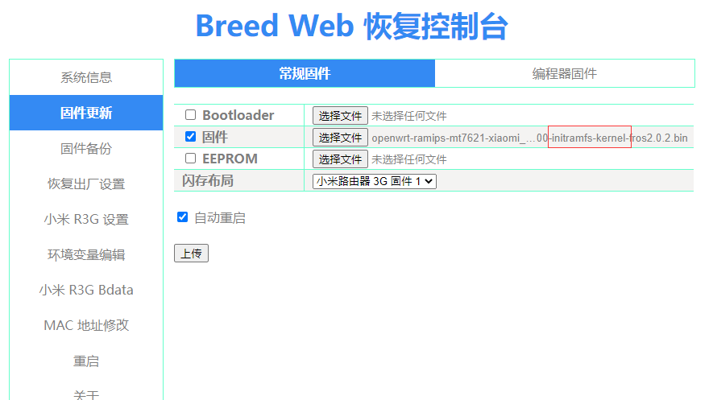
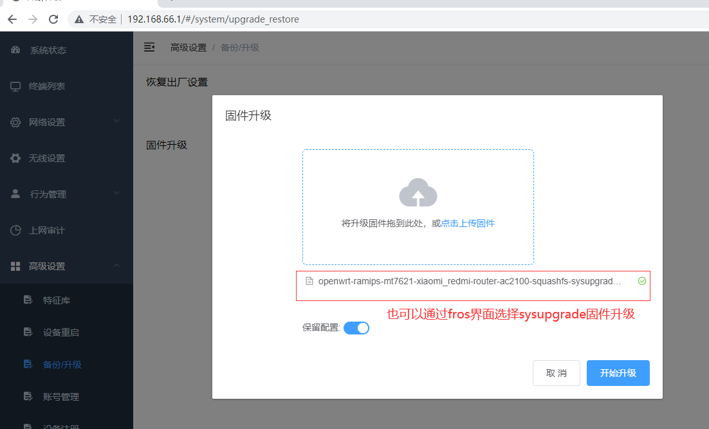
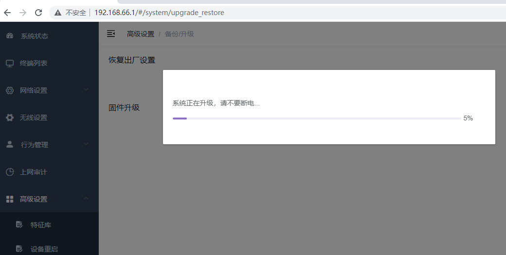
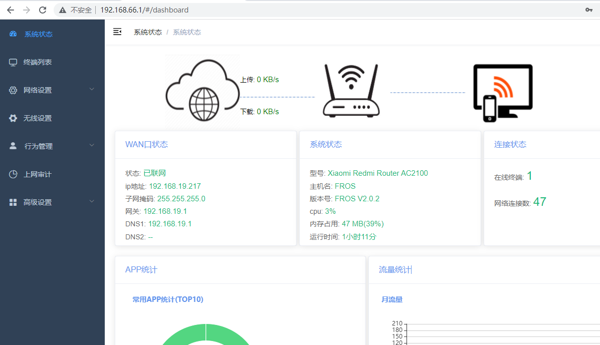

# **红米`AC2100`升级`fros`教程**

`Openwrt`不同的版本`web`升级可能存在固件格式错误问题，

存在不兼容情况，

若出现格式错误需通过boot下升级新版本，

该文档主要讲解如何通过`breed`升级固件以及如何刷`breed`。

## 刷`uboot`

### `breed`简介

`breed`是一款应用广泛的路由器不死`uboot`，

通过`breed`可以很方便的切换不同的固件，

并且通过`breed`升级固件不会出现变砖，

类似于`pc`的`bios`，

所以若要切换不同版本或者遇到固件格式不匹配时，

最好先升级`breed`。

### 如何升级`breed `

若设备已经刷好`openwrt`(`fros`)，

但是没有刷`breed`，

可以参考以下教程进行升级。

> **注意：**
> 
> 刷机有风险，
> 
> 该教程仅供参考，
> 
> 刷机引起的一切问题与该文档发布者无关。

### **如何查看是否已经升级了`breed`？**

将设备断电，长按`reset`键不松，设备上电，大概`5-10s`后松开`reset`键，期间观察系统灯是否出现快速闪烁，若闪烁基本上已经刷了`breed`。

为了确认，需尝试进入`breed`界面。

电脑网线和路由器`lan`口直连，之后通过浏览器访问`192.168.1.1`，查看是否出现以下界面



若没有出现该界面，表示`uboot`还是官方的，非`breed`，这样就需按教程刷`breed`。

### **步骤：**

1. 等系统正常启动，保证电脑能够正常访问路由器页面

2. 下载`ssh`客户端工具，比如`putty`
   
   > [下载地址](https://www.putty.org)

`ssh`客户端用于连接路由器命令行后台，是标准的工具，这里以`putty`作为实例，

`putty`使用方法也可以网上搜索教程，新建一条连接路由器`ssh`服务的连接即可。

1. 登录路由器后台

如路由器的`ip`为`192.168.66.1`，配置如下图



填好后直接`open`进入登录界面，用户名和密码和`openwrt`界面的登录信息一样，用户名为`root`

1. 上传`breed`文件到路由器

上传文件到`openwrt`路由器的方法有很多，比如`tftp`、`winscp`等，

这里介绍通过页面上传的方法，也是最简单的方法

登录`openwrt`管理界面，进入系统 --> 文件传输界面

选择教程目录的`breed-mt7621-xiaomi-r3g.bin`文件上传



注意上传的文件位于`/tmp/upload`下面

1. 开始刷`breed`
   
   在`putty`登录成功的路由器后台执行以下两条命令（复制绿色部分粘贴到命令行后台)
   
   ```shell
   cd /tmp/upload/
   
   mtd write breed-mt7621-xiaomi-r3g.bin Bootloader
   ```
   
   

若没有报错并且最后一行输出为`Writing from breed-mt7621-xiaomi-r3g.bin
to Bootloader` 表示成功，否则检查自己的环境是否有误或者重试。

1. 检查是否能正常进入`breed`界面
   
   断电按住`reset`键按照前面的步骤检查是否能进入`breed`界面

## 升级其他`openwrt`或`fros`固件

这里讲解如何升级`fros`固件，当然升级`openwrt`固件也类似，只是固件名称不一样而已

首先需下载两个文件：

可以进入`fros`发布目录索索`redmi-router-ac2100`，带有该字段的就是红米`ac2100`固件，

其中包含`kernel`字段的是中间固件，用于在`breed`下升级，

而带有`upgrade`字段的为最终固件，需在中间固件起来后再次升级。

比如`2.0.9`版本的固件名称为：

```shell
fros-xiaomi_redmi-router-ac2100-initramfs-kernel-2.0.9.bin -> （中间固件）

fros-xiaomi_redmi-router-ac2100-squashfs-sysupgrade-2.0.9.bin ->（最终固件）
```



## 升级中间固件：

进入`breed`模式：

1. 设备断电

2. 长按住`reset`键，不要松，

3. 之后接入电源，大概`10s`左右后松开`reset`键，
   注意要橙色灯快速闪烁。（这一步类似`PC`进入`BIOS`模式）

通过浏览器访问`192.168.1.1`，进入`breed boot`界面


进入了`breed`就可以随便更换系统了

由于`breed`默认不能启动`openwrt`固件，需设置一个环境变量

环境变量：

`xiaomi.r3g.bootfw` 设置为`2`

如下图所示：



设置好环境变量后点击固件更新

选择`initramfs-kernel`固件，之后升级，等待系统起来

> **备注：**
> 
> 带 `initramfs-kernel` 字样的固件表示文件系统只读，
> 
> 在`breed`下只能先升级该文件才能成功，

当升级成功后进入系统界面再次升级`sysupgrade`固件。



## 升级最终固件

系统启动成功后通过浏览器访问`192.168.66.1`进入登录界面

升级最终固件（注意版本号为自己下载的版本）

```shell
fros-xiaomi_redmi-router-ac2100-squashfs-sysupgrade-2.0.9.bin
```

进入`fros`界面选择固件升级

注意只要是固件名带有
“`redmi-router-ac2100-squashfs-sysupgrade`”就是红米`AC2100`的`web`升级固件，

根据自己需升级的版本进行选择即可，

若出现格式错误之类的，那应该是当前固件和升级固件版本不兼容，

可以先通过`breed`升级同版本的`kernel`固件，之后再升级。



升级后系统会自动重启，升级完成


